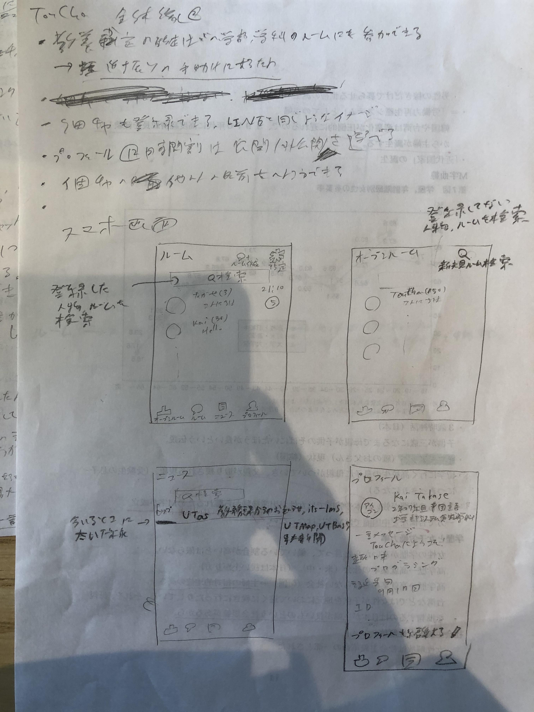
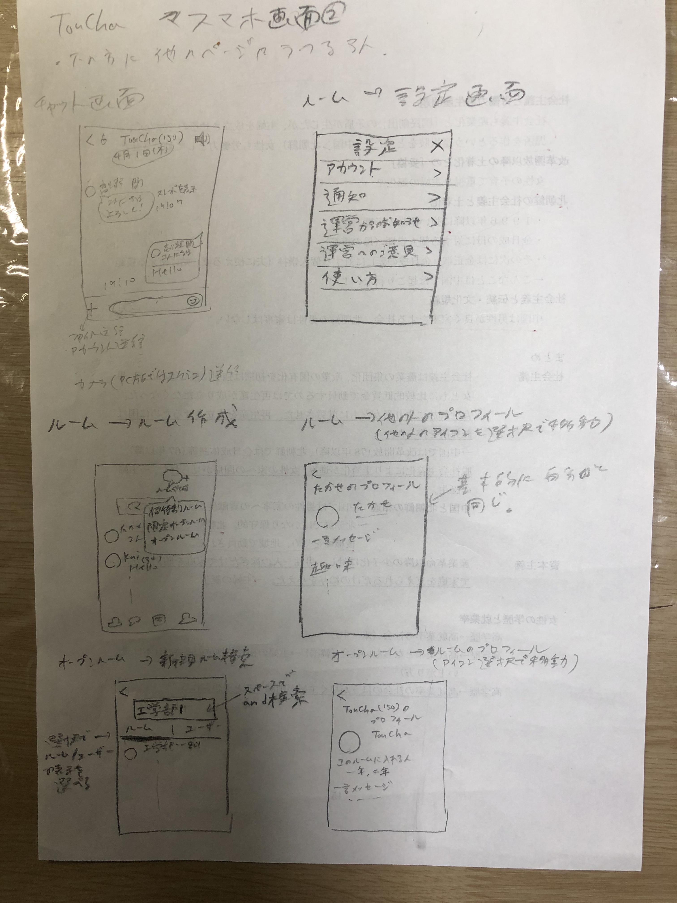
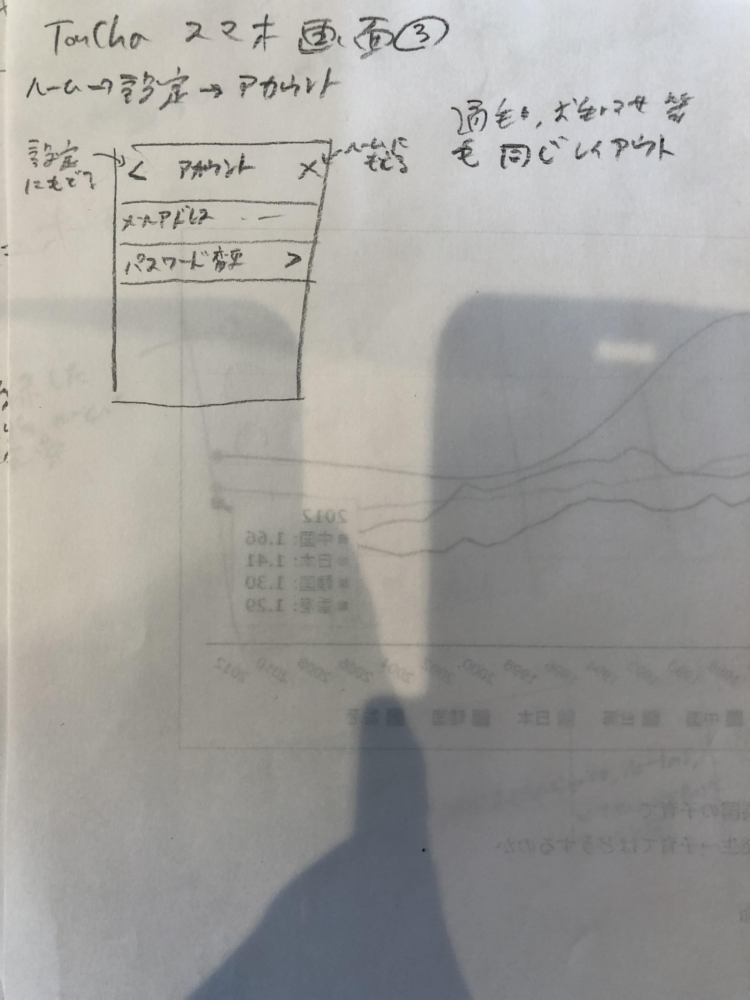
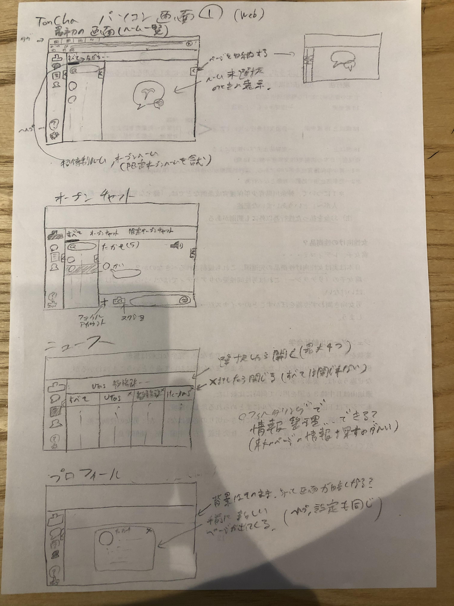

# 機能設定MTG

## 全体
- Slackほどかたくるしくなく、LINEくらいカジュアルに会話ができるチャットアプリ
- でも見た目、機能はSlackっぽくて、ルームごとに分かれてチャットをする

## 機能

Slackとの違い：
- 大学生限定→学部・学年で人を限定してルームを作成できる（〇〇学科のグル）みたいな
    - 限定オープンルームでは、前期課程の人とその学科の人が参加可能
- プロフィールに時間割（必須ではない）、学部/学科を表示
- 人の検索機能（〇〇学科の人とか）
- 東大生であれば招待されずにだれでも参加できる

- ルームははじめから作っており、過去の（自分が参加する前の）会話も閲覧可能
- 下の方（スマホ）、左の方（PC）に他のページに移る欄がある

## ルーム

### ルームの種類
- オープンルーム（誰でも参加可能）
    - TwitterのTLみたいなもの？
    - 登録しなくても見ることができるので、（オープンルーム一覧から）ここで発言することは実質東大生全員に発信しているような感覚。
- 限定オープンルーム【仮】（条件に合致する人（〇〇学科）だけが参加可能）。後からアプリを入れた人も、その条件に合致している場合、オープンルーム一覧、オープンルーム検索でこのルームが表示される。
- オープンルーム、限定オープンルームは、そのルームに対する説明文を載せられ、#もつけられる。
- 招待制ルーム（メンバーが招待した人のみ参加可能）
- ルームが無限に増える可能性があるので、ある程度運営で制限する？（数とか）同じようなグループが何個もできても困る

### デフォルトで作られているルーム：
- 学部/学科ごとのオープンルーム
    - 他学部/他学科の人、オープンルーム一覧、オープンルーム検索で表示されず、登録もできる
    - そのルームを登録するとルーム一覧に表示され、通知も設定できる
- 全授業のオープンルーム
    - そのルームを登録するとルーム一覧に表示され、通知も設定できる
- 設定でそのルームを限定オープンルームに変えられる（見られる人を自由に選択できる）（招待制には変えられない）

### lounch_version

### 機能
- ルームを作成、登録、退会
    - 登録、退会時はそのコメントを表示
    - 同じ曜限でも複数登録あり
- Twitterのタグ（＃）機能
    - オープンルーム検索をするとき、オープンルームの説明にタグ付けで検索できるように（＃プログラミング1年）
- ルームのアイコン
    - 一覧で表示できるチャンネルの数が減る
    - → 簡単にタッチしようと思える？
    - → 情報を絞ったほうが良い(カジュアル度UP)
    - ルームを選択するとそのルーム内が、長押し選択するとプロフィールが見える。PC版だとホバリング
- 一つ画像を選択すると、それまでにおくられた画像をスライドショーで表示
    - 写真一覧はいらない（余裕があればあっても良い）
- メンション機能（プロフィールの項目でもメンションできる　@2020erみたいな）
- スレッド機能
    - Slackの「このルームにも投稿する」機能をつけることで、スレッドが見えなくなることを防ぐ
    - 「このルームにも投稿する」と、表示がリプライっぽくなる（もとのコメントが一行だけ表示される）
- アナウンス機能+LINEのノート
    1. 一つのコメントをアナウンスする
    1. それがルーム画面の上部に常に表示される
    2. それをクリックすると、そのコメントとスレッドが表示される（そのコメントの「スレッドを表示」ボタンを押したのと同じページに移動）
    3. **これによってスレッド機能とノート機能が一緒にできる**

- 未実装の機能
    - 通話、ビデオ通話
    - 既読
        - 既読機能があるとプレッシャーになりやすい？
        - そもそも災害時のための機能だから必要ない
        - 既読をつけてから考えていることが悟られたくない？
        - リアクション機能で代用できる
- 個人チャット
    - 他の人の名前も変更できる
    - ↑名前が本名でない以上必要
- ルームごとのフォルダ
    - ルームごとにファイル共有用のドライブを設ける
    - シケプリ用
- 「現在のルーム」みたいな感じで今授業中のルームをトップに表示（時刻・曜日から推定）

（追加機能？）この講義を受講している人はこんな講義も受講しています

### コメント
- コメントの種類【通常】
    - 以下のような媒体が考えられる。またはそれらのミックス
    - プレーンテキスト（普通の文）
    - Markdown形式のテキスト（箇条書き、ナンバリング、リンクなど）
    - リアクション（スタンプみたいなもの。）
    - 写真、動画（ストレージから選択、カメラで撮ったもの）
    - PC版→スクリーンショット + ちょっと書き込める（テキスト、矢印、四角、丸） + クリッピング
    - 任意ファイル（サイズ制限：1GB？）
        - サーバのストレージがいっぱいになり次第、古いものから削除
    - アカウント送信
    - 位置情報
- コメントの種類【システム】
    - サーバーからのメッセージ
        - 送信失敗メッセージ
        - データオーバー
        - その他のエラーメッセージ
    - ルーム作成
    - 誰かを招待 (/invites @[username] [......]] で招待可能)
    - 誰かがルーム参加
    - 誰かがルームを退会
    - ルーム削除は公式ではないルームの人数が０になったとき。
    - 公式のルームは削除されない
- コメント操作
    - すべてのコメント：テキストのコピー、スレッドを表示、通報、リアクション
    - 自分のコメント：編集、削除

- 「コメントを送信した時間」と「スレッドを表示」ボタン（スレッドに1つ以上返信されたものの場合）がコメントの横に表示される
- リンクを送信したら、そのリンク先の中身も表示できるようにしたい
    - リンク先のタイトル + favicon + metadataの表示
    - 代表例はTwitter、YouTubeなど

### アカウント
- アカウントは原則一人一アカウントである。
- 東大のgmail(g.ecc.u-tokyo.ac.jp)を使って登録することで、東大生であることを確認する。
- 複数端末で同時にログイン可能
機能：
- アカウント作成
- 削除

#### 作成
- ECCSクラウドメール(g.ecc.u-tokyo.ac.jp)とパスワードを入力し、アカウント登録
- メールを送って、アカウントをVerify

#### プロフィール
- 以下のものをプロフィール欄に埋め込む
    - 名前（必須）（本名でなくて良い。Twitterのニックネームみたいな）
    - アイコン
    - 学年、組（必須）
        - 学年（1〜4）で前期課程/後期課程を判断
    - 学部、学科（必須）
    - 語学
    - 趣味
    - SNS（Twiter,インスタなど）のアカウント(複数)
    - 誕生日
    - IDナンバー（必須）（運営で付与）
    - 時間割
    - 一言メッセージ
- プロフィールは必須項目以外、公開/非公開を選べる
- グループの登録している人の人数がルームの名前の後に（）で表示される
- 人の検索する条件は、人のプロフィールから情報を持ってくる。一言メッセージ以外の項目から選択可。
- 同じクラスの人をLINEの「友達かも？」みたいな感じで表示する？
- 自分が登録しているオープンルームと似たようなオープンルーム（同じ＃が複数つけられているもの）もおすすめ表示する？

## 画面遷移
1. インストール
    2. アカウント登録画面
    3. メール認証（この段階は他のアプリをまねる）
    4. OK

メイン画面

PC：スマホと基本同じ。

スマホ：
- プロフィール画面
  - 設定 
    - アカウント
      - メールアドレス
      - パスワード変更
    - 運営へのご意見、ヘルプ（アプリの使い方）
    - 通知
      - 全体の通知ON/OFF（アイコン右上の通知数、OS標準のメッセージ機能）
      - ニュースの通知を受け取る（特定のニュースのみも可）
    - 運営からのお知らせ
- ニュース
  - 教務課からのお知らせ、UTas,itc-lms,UTMap、UTBase、東大新聞などの最新ニュース,更新をスライドショー形式
    - 最初の3つはスクレイピング申請（東大生のみにしても、はたして申請通るのか...)
- ルーム一覧（起動直後）
    - ルーム名・ルームアイコン・最後のコメント・（ルーム説明）が一覧表示
    - ルーム画面（これは下のアイコンには表示されない）
    - ルーム一覧から何らかのルームを選択すると、ルーム内のチャット画面が表示される。戻るボタンでルーム一覧へ。
- オープンルーム一覧（通知機能なし）
    - 限定オープンルームは条件に合致しないと表示されない

## デザイン
- イメージカラーは黄色
    - 眩しすぎないように
    - 黄色を使用する場所：
        - アイコン、区切り線
    - UIに白背景だと使いづらそう
        - オレンジより or 赤よりの黄色にする？
        - デザイン班がんばれ
- 画面の背景色は白または黒
    - ダークモードつける
- ルームの通知ON/OFF：チャットルームの上の方
- アイコンやチャットの枠は丸型
    - カジュアルさをもとめる- メンバー招待、通知ON/OFF、退会（ルームの上部に表示）
- チャットは日をまたぐコメントの間に何月何日、昨日、今日と表示される

### スマホ画面

### pc画面

- ページ収納（PC版）
  - メニュー、ルーム一覧、チャットスペースのそれぞれ収納できる
  - ページの横幅を小さくすると、それに合わせてメニュー、ルーム一覧がこの順で勝手に収納される

## 最低限必要な機能

### 2ヶ月後の目標
- [ ] ルームの作成（2種類＝オープン、招待）
- [ ] チャット機能（テキストのみ）
- [ ] スレッド機能
- [x] ログイン、アカウント登録
- [ ] 自分のプロフィールの表示、編集
- [ ] 通知
  - [ ] 通知の切り替え

### Sセメ終了時（7月中旬）の目標(できそうならここでリリース)
- [ ] チャット（リアクションなどのその他の機能）
- [ ] 画像の送信
- [ ] オープンルームの登録、登録解除
- [ ] 人、オープンルームの検索機能（〇〇学科の人とか）
- [ ] アイコン選択でプロフィール表示
- [ ] 普通の文、最低限の絵文字が使えるチャット

### 最終的な目標（Aセメの最初）
- [ ] 最初から最低限の授業（基礎科目と総合科目）のルームがある
- [ ] メンバーの招待
- [ ] 招待ルームからの退会
- [ ] 東大生のみ可能のアカウント作成、ログイン
- [ ] チャットの送信時間表示
- [ ] 設定ボタン
  - [ ] アカウント、通知、運営からのお知らせ、運営へのご意見、使い方（ヘルプ）

